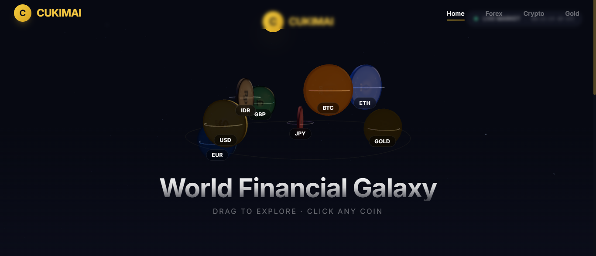
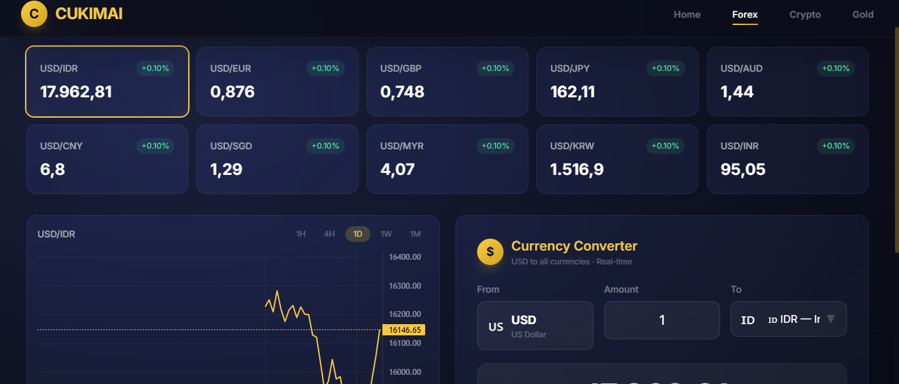
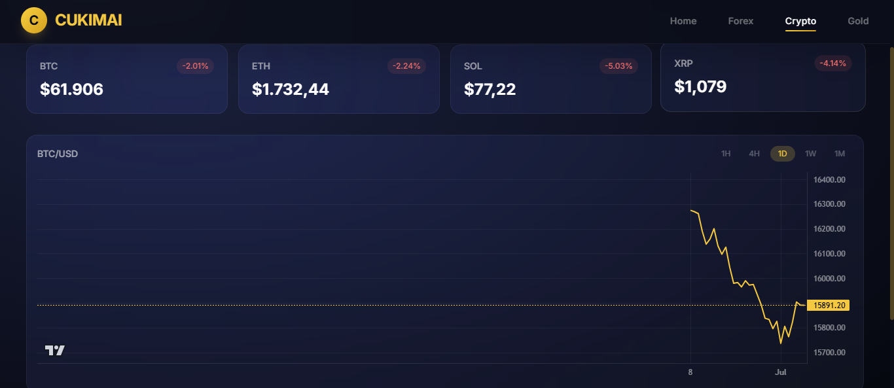
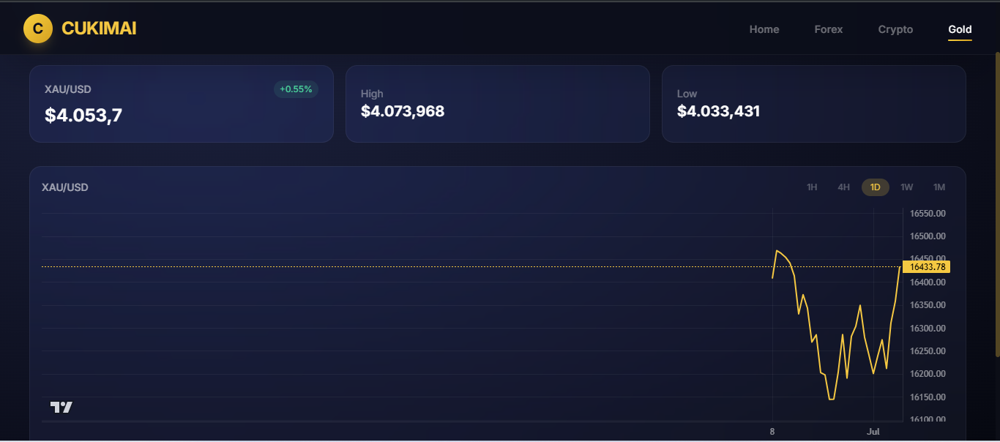

# CUKIMAI

### World Financial Galaxy

Modern financial platform for **Forex**, **Crypto**, and **Gold**.

<p>


</p>


</div>

---

## Demo

<p align="center">

</p>

---

## Preview

| Home |
|------|
|  |

| Forex | Crypto |
|-------|--------|
|  |  |

| Gold |
|------|
|  |

---

## Features

- Real-time Forex
- Real-time Cryptocurrency
- Live Gold Price (XAU/USD)
- Interactive 3D Coin Galaxy
- USD Currency Converter
- TradingView Charts
- Responsive Design
- Dark Premium UI

---

## Tech Stack

- Next.js 15
- TypeScript
- JavaScript
- Tailwind CSS
- Three.js
- React Three Fiber
- Framer Motion
- GSAP

---

## APIs

| Service | API |
|---------|-----|
| Forex | ExchangeRate API |
| Crypto | CoinGecko API |
| Gold | GoldAPI |

---

## Installation

```bash
git clone https://github.com/kamunanay/cukimai.git

cd cukimai

npm install

npm run dev
```

---

## Deploy

```bash
npm run build

npm start
```

Compatible with:

- Cloudflare Pages
- Vercel
- Ubuntu VPS
- Debian VPS

---

## License

This project is licensed under the **MIT License**.

[View License](LICENSE)

---

<div align="center">

Made with ❤️ by **CUKIMAI**


---

## Quick Start

```bash
git clone https://github.com/kamunanay/cukimai.git

cd cukimai

npm install

npm run dev
```

---

## License

[MIT License](LICENSE)
